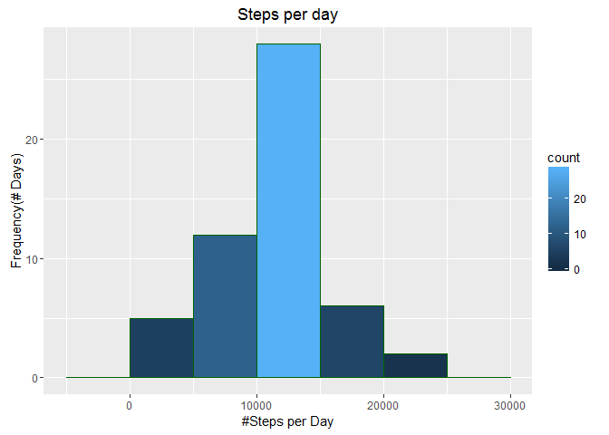
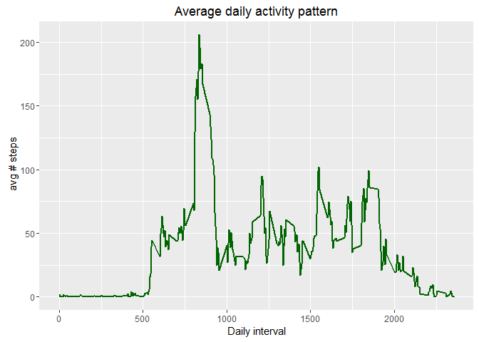
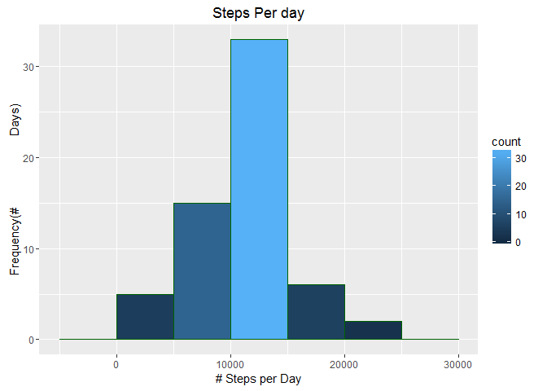
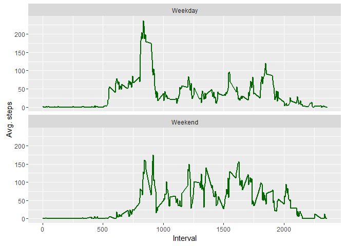

# PA1_template
JonesHarris  
March 6, 2016  

This is an R Markdown document. Markdown is a simple formatting syntax for authoring HTML, PDF, and MS Word documents. For more details on using R Markdown see <http://rmarkdown.rstudio.com>.

When you click the **Knit** button a document will be generated that includes both content as well as the output of any embedded R code chunks within the document. You can embed an R code chunk like this:


```r
library(knitr);
library(ggplot2)
```

```r
unzip("C:/Users/CrisWin/Downloads/activity.zip")
activity <- read.csv("activity.csv", na.strings = "NA", colClasses = c("numeric", "character", "numeric"))
```

```r
activity$date <-as.Date(activity$date) #String to date
```


<h2>What is the mean total number of steps taken each day?</h2>
1. Calculate the total number of steps per day
2. Using a histogram...


```r
steps.per.day <-aggregate(steps~date, activity, sum, na.action = na.omit)
ggplot(steps.per.day, aes(x = steps)) +
  geom_histogram(aes(fill = ..count..),colour = "darkgreen", binwidth = 5000) +
                  labs(title = "Steps per day", x = "#Steps per Day", y = "Frequency(# Days)")
```



3. Calculate and report mean and median of the total number of steps taken per day:

```r
mean.steps <-round(mean(steps.per.day$steps, na.rm=TRUE), 2)
median.steps <-round(median(steps.per.day$steps, na.rm = TRUE), 2)
```
Mean for the total number of steps is 10766.19.  Median for the total number of steps is 10765.

<h2>What is the average daily activity pattern?</h2>
1. Make a time-series plot of the 5-minute interval (x-axis) and average number of steps taken, averaged across all days (y-axis)


```r
avg.daily.steps.per.interval <-aggregate(activity["steps"],
               by = list(interval = activity$interval), FUN = mean, na.rm = TRUE)
ggplot(avg.daily.steps.per.interval, aes(x = interval, y= steps))+
  geom_line(color = "darkgreen", size = 1) +
  labs(title = "Average daily activity pattern", x = "Daily interval", y = " avg # steps")
```


2. Which 5 minute interval, on average across all days, contains the maximum number of steps?

```r
daily.interval.max.steps <- avg.daily.steps.per.interval[which.max(avg.daily.steps.per.interval$steps),]$interval
```
The daily average activity 5 minute interval maximum starts at 08:35 averaging 206 steps.

<h2> Imputing missing values</h2>
1. Calculate and report the total number of missing values in the dataset

```r
missing.values <- sum(is.na(activity$steps))
num.dates.missing.value <-length(unique(activity[is.na(activity$steps), "date"]))
num.wdays.missing.value <-length(unique(weekdays(as.Date(unique(activity[is.na(activity$steps), "date"])))))
```
There are 2304 missing values for 8 dates and for 6 weekdays.

2. Devise a strategy for filling in all of the missing values in the dataset.
How many measures each of the weekday has:

```r
table(weekdays(as.Date(unique(activity$date))))
```

```
## 
##    Friday    Monday  Saturday    Sunday  Thursday   Tuesday Wednesday 
##         9         9         8         8         9         9         9
```
How many measures each weekday is missing:

```r
table(weekdays(as.Date(unique(activity[is.na(activity$steps), "date"]))))
```

```
## 
##    Friday    Monday  Saturday    Sunday  Thursday Wednesday 
##         2         2         1         1         1         1
```
The mean is reasonable to use to assess the activity for each day in the week to identify  missing values. Using the median will skew the average observation used in previous work and distort previous mean calculations in our analysis.

3. Create a new dataset that is equal to the original dataset but with the missing data filled in. Iterate each row and replace missing values.

```r
ref <-aggregate(activity["steps"], by = list(wday = weekdays(activity$date), interval = activity$interval), FUN = mean, na.rm = TRUE)
activity$steps <-mapply(function(steps, wday, interval){
  ifelse( is.na(steps),
          ref[ref$wday ==wday & ref$interval == interval, "steps"],
          steps) },
  activity$steps, weekdays(activity$date), activity$interval)
```
4. Make a histogram of total number of steps taken each day.  

```r
steps.per.day <- aggregate(steps~date, activity, sum,   na.action = na.omit)
ggplot(steps.per.day, aes(x=steps)) +
  geom_histogram(aes(fill=..count..), colour = "darkgreen", binwidth = 5000) +
                   labs(title = "Steps Per day", x = "# Steps per Day", y = "Frequency(#                      Days)")
```


Calculate and report the mean and median total number of steps taken per day.

```r
mean.steps <- round(mean(steps.per.day$steps, na.rm = TRUE), 2)
median.steps <-round(median(steps.per.day$steps, na.rm = TRUE), 2)
```
Mean total number of steps per day is 10821.21.
Median total number of steps per day is 11015.

<h2> Are there differences in activity patterns between weekdays and weekends?</h2>

1. Create a new factor variable in the dataset with 2 levels - weekday and weekend
to identify a weekday or weekend day

```r
activity$type <-factor(ifelse (weekdays(activity$date) %in% c("Saturday", "Sunday"), 
                               "Weekend", "Weekday"))
```
2. Make a panel plot with time series of 5-min. interval and average number of steps taken, averaged across all weekend or weekday days.

```r
steps.pattern.by.type <- aggregate(steps ~ interval + type, activity, mean, na.action = na.omit)

ggplot(steps.pattern.by.type, aes(x=interval, y=steps))+
  geom_line(colour = "darkgreen", size =1) + facet_wrap(~ type, nrow=2, ncol=1) +
  labs(x = "Interval", y="Avg. steps")
```


Weekend interval have a higher and frequent interval with an average of 175 steps spread throughout the day, compared to weekday intervals, where is a high peak between 750 and 1000 intervals showing over 250 steps, but throughout the day lower intervals with steps ranging less than 125 steps.  
